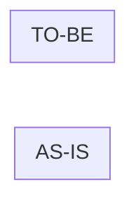

## 관련 이슈

- closes #

## 변경 요약

-

## 스펙

- [ ] `docs/specification.md` 갱신 (동작 변경이 없으면 사유: )
- 추가·변경된 요구사항 ID:
- 추가·변경된 TC:

## 검증

- [ ] `./gradlew check`
- [ ] `npm --prefix firebase test` (규칙 변경 시)
- [ ] 규칙 mutation 확인 (규칙 변경 시): 지운 조건 → 실패한 테스트
- [ ] 실기기 확인 (통합 TC 해당 시):

## 구조 변경 (해당 시)

