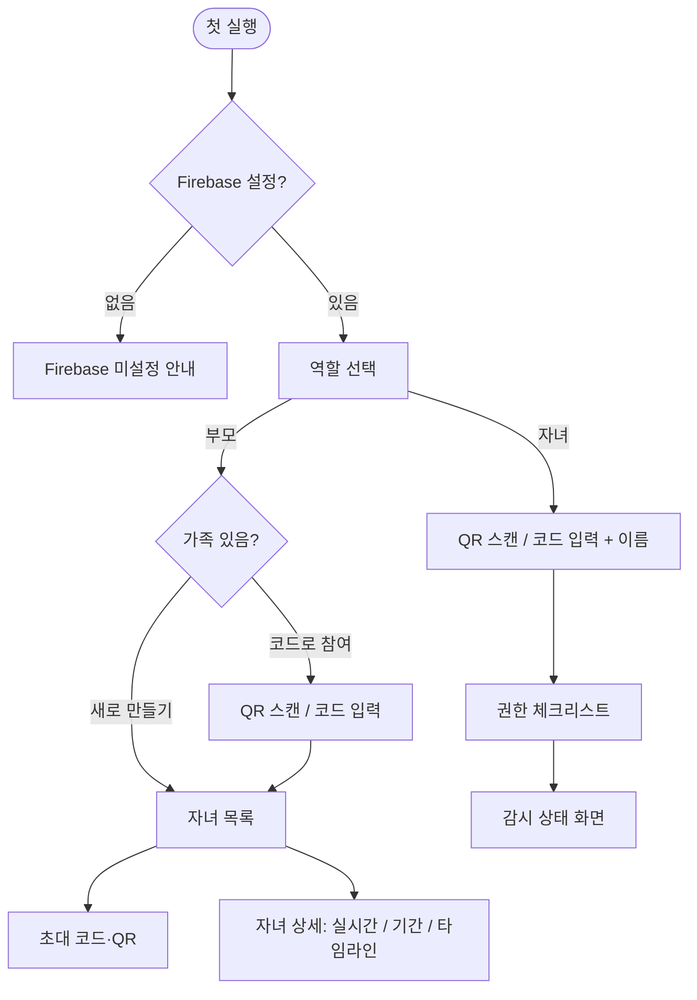
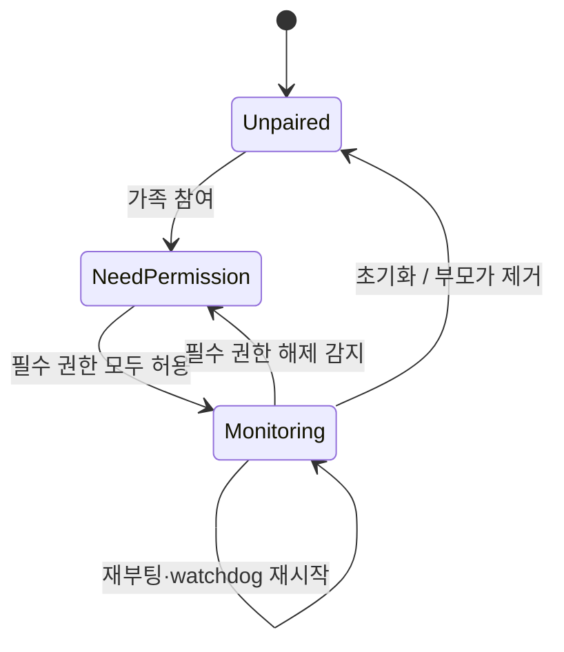

# argos 스펙

## 1. 개요

| 항목 | 값 |
| --- | --- |
| 문서명 | argos specification |
| 작성자 | hwanyu365 (Claude Code 작성 보조) |
| 작성일 / 최종 수정일 | 2026-10-09 / 2026-10-09 |
| 버전 | 0.2 (GH-1 실측 반영) |
| 기준 커밋 ID | (최초 커밋 전) |

- **프로젝트명:** argos — 자녀 Android 기기의 앱 사용을 부모 Android 기기에서 실시간·기간 단위로 확인하는 앱
- **목적 (Why):**
  - Google Family Link 는 앱별 사용량은 보여주지만 **현재 실행 중인 앱**과 **보고 있는 내용**(영상 제목, 웹페이지)은 보여주지 않음
  - 부모가 "지금 무엇을 하고 있는지"와 "한 달 동안 무엇에 시간을 썼는지"를 같은 앱에서 확인
- **운영 제약:** 운영 비용 0원 → 자체 서버 없이 각 사용자의 Firebase 무료(Spark) 프로젝트를 사용

### 1.1 비즈니스 규칙 (원 요구)

- `BR#1` 자녀·부모 Android 기기에서 실시간 앱 정보와 기간 정보를 감시·확인할 수 있어야 한다 [요구사항]
- `BR#2` 실시간 정보로 현재 실행 중인 앱과 사용 시간을 표시하고, 브라우저·YouTube 인 경우 무엇을 보는지까지 표시한다 [요구사항]
- `BR#3` 기간(기본 1달) 동안 앱별 사용 시간을 표시하며, 그 근거는 BR#2 에서 수집한 정보다 [요구사항]
- `BR#4` 클라우드 운영 비용이 발생하지 않아야 한다 [요구사항]
- `BR#5` UI/UX 는 상용 수준이어야 한다 [요구사항]
- `BR#6` 소스는 GitHub public 저장소로 공개되며, 누구나 자기 Firebase 프로젝트로 빌드해 쓸 수 있어야 한다 [요구사항]

## 2. 목표 및 범위

### In Scope

| UC | 목표 | 우선순위 | 근거 |
| --- | --- | --- | --- |
| UC1 | 가족을 만들고 자녀 기기를 연결해 **자녀가 지금 쓰는 앱과 사용 시간**을 실시간으로 본다 | P1 | 단독으로 BR#1·BR#2 의 핵심 가치를 주는 최소 제품 |
| UC2 | 지정 기간(기본 30일)의 **앱별 사용 시간**과 일별 추이를 본다 | P1 | BR#3 |
| UC3 | 영상 제목·브라우저 URL 을 실시간으로 보고, 하루 단위 **타임라인**으로 되짚는다 | P2 | BR#2 "되면 좋다" |
| UC4 | 자녀 기기의 **감시가 중단**(권한 해제, 앱 종료·삭제, 오프라인)되면 알아챈다 | P2 | 우회 시 데이터 신뢰성 |

### Out of Scope

- 앱 차단·사용 시간 제한 → Family Link 가 담당
- 앱 삭제 방지(Device Admin) → Family Link 의 앱 설치 승인으로 대체
- iOS, 웹 대시보드
- 푸시 알림(FCM) → 부모가 앱을 열었을 때 확인하는 것으로 충분하다고 판단. 필요 시 별도 이슈
- Play Store 배포 → 접근성 서비스로 다른 앱의 내용을 수집하는 것은 Play 정책 위반이므로 APK 사이드로드로만 배포
- 앱 아이콘 원격 전송 → 부모 기기에 설치된 앱만 아이콘, 나머지는 이니셜 아바타

## 3. 요구사항

### 3.1 사용자 스토리

- US·BR 은 매핑된 FR/NFR 의 TC 로 검증한다 (BR#1·2 → UC1·UC3, BR#3 → UC2, BR#4 → NFR#1, BR#5 → NFR#9, BR#6 → NFR#5)

- `US#1` 부모로서, 자녀가 **지금** 어떤 앱을 얼마나 쓰고 있는지 알기 위해 실시간 화면을 원한다 [UC1] → FR#12, FR#15
- `US#2` 부모로서, 자녀 기기를 쉽게 연결하기 위해 QR 이나 짧은 코드로 페어링하길 원한다 [UC1] → FR#3~FR#5
- `US#3` 부모로서, 자녀 기기 설정을 한 번에 끝내기 위해 필요한 권한을 순서대로 안내받길 원한다 [UC1] → FR#7
- `US#4` 부모로서, 사용 습관을 파악하기 위해 한 달 동안의 앱별 사용 시간과 일별 추이를 원한다 [UC2] → FR#13, FR#16
- `US#5` 부모로서, 콘텐츠 적절성을 판단하기 위해 자녀가 보는 영상 제목과 웹 주소를 원한다 [UC3] → FR#10, FR#11, FR#17
- `US#6` 부모로서, 기록이 비어 있는 이유를 알기 위해 감시가 멈췄는지와 그 시점을 원한다 [UC4] → FR#18
- `US#7` 부모로서, 여러 자녀와 다른 보호자(배우자)까지 한 가족으로 관리하길 원한다 [UC1] → FR#4~FR#6

### 3.2 기능 요구사항

**공통**
- `FR#1` 첫 실행 시 역할(부모/자녀)을 선택한다. 역할은 기기에 저장되며, 바꾸려면 "초기화"(로컬 데이터 삭제 + 가족 탈퇴)를 거친다 [요구사항]
  - Why: 한 기기가 두 역할을 오가면 자녀가 부모 모드로 전환해 기록을 지우는 경로가 생김
- `FR#2` Firebase 설정값이 빌드에 주입되지 않았으면 모든 기능 대신 "Firebase 미설정" 안내 화면을 표시한다 [요구사항]

**페어링 (UC1)**
- `FR#3` 부모는 가족을 생성한다 → 생성자는 해당 가족의 첫 부모 멤버가 된다 [요구사항]
- `FR#4` 가족 멤버인 부모는 초대 코드를 발급한다 → 10자리 코드와 같은 값을 담은 QR 을 표시하고, 코드는 10분 뒤 만료된다 [요구사항]
  - 만료 전에는 여러 기기가 같은 코드로 참여할 수 있다 (자녀 여럿을 연달아 연결하는 흐름)
- `FR#5` 자녀·부모 기기는 QR 스캔 또는 코드 입력으로 가족에 참여한다. 자녀는 참여 시 표시 이름을 입력한다 [요구사항]
- `FR#6` 부모는 가족에서 자녀 기기를 제거할 수 있다 → 제거된 기기의 데이터도 삭제된다 [요구사항]

**자녀 기기 수집 (UC1~UC3)**
- `FR#7` 권한 체크리스트를 표시하고 각 항목의 허용 여부를 실시간으로 반영한다 [요구사항]

  | 권한 | 필수 | 없을 때 |
  | --- | --- | --- |
  | 사용 정보 접근 (`PACKAGE_USAGE_STATS`) | 필수 | 수집 불가 → 감시 시작 버튼 비활성 |
  | 알림 표시 (`POST_NOTIFICATIONS`, API 33+) | 필수 | Foreground Service 알림을 띄울 수 없음 |
  | 배터리 최적화 제외 | 필수 | 백그라운드에서 종료되어 기록 누락 |
  | 접근성 서비스 | 선택 | 브라우저 URL 미수집 (UC3 일부) |
  | 알림 접근 (NotificationListener) | 선택 | 영상 제목 미수집 (UC3 일부) |

  - API 33+ 사이드로드 앱은 접근성·알림 접근 전에 앱 정보의 "제한된 설정 허용"을 켜야 하므로 해당 단계 안내를 포함한다
- `FR#8` 감시 중에는 Foreground Service 가 상시 알림("감시 중")과 함께 동작하며, 화면이 켜져 있는 동안 3초 주기로 `UsageEvents` 를 읽어 세션을 만들고 로컬 DB 에 저장한다 [요구사항]
  - Why: OS 가 이벤트를 보관하므로 프로세스가 죽었다 살아나도 마지막 처리 시각부터 소급해 세션을 복구할 수 있음
- `FR#9` 기기 재부팅 후, 그리고 15분 주기 watchdog 에서 서비스가 죽어 있으면 자동 재시작한다 [요구사항]
- `FR#10` 포그라운드 앱이 미디어 세션을 재생 중이면 그 제목을 세션 상세(title)로 기록한다. YouTube Shorts 는 미디어 세션이 제목을 주지 않으므로 접근성으로 대체한다 (§6.3 X#1b) [요구사항]
- `FR#11` 포그라운드 앱이 지원 브라우저이면 주소창의 URL 을 세션 상세(url)로 기록한다. 지원 목록에 없는 브라우저는 상세 없이 앱만 기록한다 [요구사항]
  - Why: 실측 결과 브라우저의 페이지 제목은 접근성 트리에 노출되지 않음 (GH-1)
- `FR#12` 현재 상태(live)를 포그라운드 앱·상세가 바뀔 때 즉시, 그 외에는 60초마다 heartbeat 로 업로드한다 [요구사항]
- `FR#13` 일별 앱 사용 합계(daily)와 세션 목록(timeline)을 15분마다, 그리고 날짜가 바뀔 때 업로드한다. 업로드 실패분은 다음 주기에 재시도한다 [요구사항]
- `FR#14` 로컬과 원격 데이터 모두 90일이 지나면 삭제한다 [요구사항]
  - Why: 조회 기본값은 30일이지만 비교·조정 여유를 두되, 무료 저장 한도(1GB) 안에 머물도록 상한을 둠

**부모 화면 (UC1~UC4)**
- `FR#15` 자녀 목록에서 자녀마다 현재 앱(아이콘·이름), 현재 세션 경과 시간, 그 앱의 오늘 누적 시간, 상세(title/url), 감시 상태를 표시하고 실시간 갱신한다 [요구사항]
- `FR#16` 자녀 상세의 "기간" 탭은 기본 최근 30일의 앱별 합계를 내림차순으로 표시하고, 일별 총 사용 시간 막대 차트를 표시한다. 기간은 오늘/7일/30일/직접 선택으로 바꿀 수 있다 [요구사항]
- `FR#17` 자녀 상세의 "타임라인" 탭은 선택한 날짜의 세션을 시간순으로 앱·시작~종료·title/url 과 함께 표시한다 [요구사항]
- `FR#18` 감시 상태를 §6.4 규칙으로 분류해 배지와 마지막 확인 시각을 표시한다 [요구사항]

### 3.3 비기능 요구사항

- `NFR#1` **비용:** Firebase Spark 무료 한도(RTDB 저장 1GB, 월 다운로드 10GB, 동시 연결 100) 안에서 동작한다. 자녀 1명 기준 하루 쓰기 2천 회 미만, 30일 데이터 1MB 미만을 목표로 한다 [요구사항]
- `NFR#2` **실시간성:** 자녀 기기에서 앱이 바뀐 뒤 5초 안에 부모 화면에 반영된다 (양쪽 온라인 기준) [요구사항]
- `NFR#3` **정확도:** 하루 앱별 사용 시간 합계가 시스템 "디지털 웰빙" 값과 ±5% 안에서 일치한다 [요구사항]
  - [확인필요] 디지털 웰빙의 집계 기준(PiP·분할화면 포함 여부)이 공개되어 있지 않음 → 세션 집계(UC2) 구현 후 TC#37 실기기 비교로 오차 원인을 확인하고 기준을 확정. 측정할 대상 코드가 없어 GH-1 에서 해소하지 못함
- `NFR#4` **보안:** 가족 데이터는 그 가족의 멤버만 읽고 쓸 수 있다. 다른 가족의 데이터에는 접근할 수 없다 [요구사항]
- `NFR#5` **비공개 설정:** 저장소에는 Firebase 프로젝트 식별값·서명 키를 두지 않는다. 값은 `local.properties` 또는 환경변수(CI 는 GitHub Secrets)로만 주입한다 [요구사항]
- `NFR#6` **투명성:** 자녀 기기에는 감시 중임을 알리는 상시 알림이 표시된다 (숨김 모드 없음) [요구사항]
  - Why: Android Foreground Service 가 알림을 강제하며, 숨겨서 감시하는 기능은 스파이웨어와 구분되지 않음
- `NFR#7` **배터리:** 화면이 꺼진 동안에는 이벤트 폴링을 멈추고 heartbeat 만 유지한다 [요구사항]
- `NFR#8` **호환성:** Android 8.0 (API 26) 이상 [요구사항]
- `NFR#9` **UI:** Material 3, 라이트·다크 테마, 한국어 기본 + 영어 리소스, TalkBack 으로 주요 정보를 읽을 수 있다 [요구사항]

## 4. 데이터 및 API 스펙

### 4.1 로컬 (자녀 기기, Room)

| 테이블 | 필드 | 비고 |
| --- | --- | --- |
| `session` | `id` PK, `pkg`, `startMs`, `endMs?`, `title?`, `url?`, `uploaded` | `endMs` null = 진행 중 세션 (최대 1개) |
| `meta` | `key` PK, `value` | `lastEventTs` (마지막 처리 이벤트 시각), `role`, `familyId`, `childId` |

### 4.2 원격 (Firebase Realtime Database)

```
pairing/{code}                                   { familyId, expiresAt }
families/{fid}/members/{uid}                     { role: "parent"|"child", name, joinedAt }
families/{fid}/children/{uid}/live               { pkg?, label?, since?, title?, url?, screenOn, updatedAt, perms: { usage, a11y, notif } }
families/{fid}/children/{uid}/daily/{yyyy-MM-dd}/{pkgKey}     seconds (number)
families/{fid}/children/{uid}/timeline/{yyyy-MM-dd}/{sessionId} { pkg, start, end, title?, url? }
families/{fid}/apps/{pkgKey}                     { label }
```

- `D#1` `pkgKey` = 패키지명의 `.` 을 `,` 로 치환한 값 → RTDB 키는 `.` 을 허용하지 않고, 패키지명에는 `,` 가 올 수 없어 역변환이 유일함
- `D#2` `updatedAt`·`joinedAt` 은 `ServerValue.TIMESTAMP` 로 쓴다 → 기기 시계 오차를 배제. 부모는 `.info/serverTimeOffset` 으로 보정한 현재 시각과 비교
- `D#3` 날짜 키 `yyyy-MM-dd` 는 **자녀 기기의 로컬 시간대** 기준 → 부모와 시간대가 달라도 자녀의 생활 하루 단위로 집계
- `D#4` 초대 코드 = Crockford Base32 10자리(50bit) → 수동 입력이 가능한 길이이면서, 10분 만료 안에서 무작위 대입이 불가능한 크기
- `D#5` 자녀 멤버의 `uid` 를 `children/{uid}` 키로 그대로 쓴다 → 규칙에서 "자기 노드에만 쓰기"를 `auth.uid` 비교로 표현할 수 있음

### 4.3 보안 규칙 계약 (`database.rules.json`)

- `R#1` `families/{fid}` 이하 읽기 → `members/{auth.uid}` 가 존재할 때만
- `R#2` `members/{uid}` 생성 → `auth.uid == uid` 이고, 쓰는 데이터의 `code` 가 `pairing/{code}.familyId == fid` 이며 만료 전일 때. 또는 가족이 비어 있을 때 첫 부모로 생성
- `R#3` `children/{uid}` 쓰기 → `auth.uid == uid` (자녀 본인) 또는 부모 멤버의 삭제(null)
- `R#4` `pairing/{code}` 생성 → 해당 가족의 부모 멤버만. 읽기 → 인증된 사용자가 코드를 정확히 알 때만 (목록 조회 금지)
- `R#5` `members/{uid}` 삭제 → 본인 또는 같은 가족의 부모

### 4.4 빌드 설정 계약

| 키 (local.properties / 환경변수) | BuildConfig 필드 |
| --- | --- |
| `ARGOS_FIREBASE_API_KEY` | `FIREBASE_API_KEY` |
| `ARGOS_FIREBASE_APP_ID` | `FIREBASE_APP_ID` |
| `ARGOS_FIREBASE_PROJECT_ID` | `FIREBASE_PROJECT_ID` |
| `ARGOS_FIREBASE_DATABASE_URL` | `FIREBASE_DATABASE_URL` |

- `local.properties` 값이 환경변수보다 우선한다. 하나라도 비면 `FR#2` 화면으로 진입한다

## 5. 화면 및 UI/UX



- **부모 / 자녀 목록:** 자녀별 카드 → 현재 앱 아이콘·이름, 경과 시간(초 단위 갱신), 오늘 누적, title/url 한 줄, 상태 배지. 화면 꺼짐이면 "화면 꺼짐"과 마지막 사용 앱
- **부모 / 자녀 상세:** 상단 탭 [실시간 | 기간 | 타임라인], 우측 메뉴에 "기기 제거"
- **자녀 / 권한 체크리스트:** 항목별 상태 아이콘 + "설정 열기" 버튼, 설정에서 돌아오면 즉시 재확인
- **자녀 / 감시 상태:** 감시 중 여부, 권한 상태 요약, 가족 이름, 초기화 메뉴

## 6. 동작 로직 및 정책

### 6.1 세션 생성 [FR#8]

- 입력: `lastEventTs` 이후의 `UsageEvents` (ACTIVITY_RESUMED, ACTIVITY_PAUSED, SCREEN_INTERACTIVE, SCREEN_NON_INTERACTIVE)
- `S#1` 다른 패키지의 RESUMED → 진행 중 세션을 그 시각에 닫고 새 세션을 연다
- `S#2` 같은 패키지의 RESUMED 가 연속되면 (앱 내 화면 전환) 세션을 유지한다
- `S#3` 진행 중 세션 패키지의 PAUSED 뒤 다른 RESUMED 없이 SCREEN_NON_INTERACTIVE → PAUSED 시각에 닫는다
- `S#4` SCREEN_NON_INTERACTIVE → 진행 중 세션을 그 시각에 닫는다
- `S#5` 제외 패키지(기본 런처, `com.android.systemui`, argos 자신)는 세션을 만들지 않지만 이전 세션은 닫는다
- `S#6` 1초 미만 세션은 버린다 (앱 전환 중 순간 노출)
- `S#7` 진행 중 세션에서 title 또는 url 이 바뀌면 그 시각에 세션을 닫고 같은 패키지로 새 세션을 연다 → 타임라인이 영상·페이지 단위로 나뉨
- `S#8` 처리 후 `lastEventTs` 를 마지막 이벤트 시각으로 갱신한다. 재시작 시 OS 보관 범위를 넘는 과거는 복구하지 않는다
- 실측: 앱 실행 후 사용 이벤트 노출까지 633~727ms (Galaxy S24+, Android 16, adb 왕복 포함 3회, GH-1) → 3초 폴링으로 NFR#2 충족

### 6.2 일별 집계 [FR#13]

- `A#1` 세션이 자정을 넘으면 자정 기준으로 나눠 각 날짜에 합산한다
- `A#2` 진행 중 세션은 집계 시점까지 합산한다
- `A#3` 업로드는 해당 날짜 전체 값을 덮어쓴다 (증분 아님) → 재시도·중복 업로드에도 값이 일정

### 6.3 상세 정보 추출 [FR#10, FR#11]

- `X#0` 접근성으로 읽는 범위는 **지원 브라우저의 주소창 노드**와 **YouTube Shorts 플레이어(`reel_player_footer_container` 하위)의 제목 노드**로 한정한다. 그 밖의 화면 텍스트(메시지, 입력 내용 등)는 읽지도 저장하지도 않는다
  - Why: 접근성 서비스는 모든 화면 텍스트에 접근할 수 있어, 범위를 계약으로 묶지 않으면 수집 범위가 조용히 넓어진다

- `X#1` 미디어: 포그라운드 패키지와 같은 패키지의 활성 `MediaController` 중 `PlaybackState == PLAYING` 인 것의 `METADATA_KEY_TITLE`
  - 실측: 일반 YouTube 영상은 `PLAYING` + 제목 노출, **Shorts 는 재생 중에도 세션이 `STOPPED` 이고 메타데이터가 비어 있음** (GH-1)
- `X#1b` YouTube Shorts: 포그라운드가 YouTube 이고 `PLAYING` 세션이 없으며 화면에 `reel_player_footer_container` 가 있으면 Shorts 로 판단한다
  - title = 접근성 트리의 Shorts 제목(best-effort). 실측상 제목은 ID 없는 노드의 content-desc 에 있으며, 탐색 규칙은 코드와 TC 가 원본이다
  - 제목을 찾지 못하면 title = "Shorts" → Shorts 시청 사실은 항상 남김
- `X#2` 브라우저 URL: 접근성 이벤트의 창에서 브라우저별 주소창 view ID 로 텍스트를 읽는다. 지원 목록은 코드의 매핑 테이블이 원본이다
  - 실기기에서 확인한 브라우저만 매핑에 넣는다 (GH-1, Android 16)

    | 브라우저 | 주소창 view ID | 얻는 값 |
    | --- | --- | --- |
    | Chrome | `com.android.chrome:id/url_bar` | 호스트 + 경로 (scheme 생략) |
    | Samsung Internet | `com.sec.android.app.sbrowser:id/location_bar_edit_text` | **호스트만** |

  - 텍스트의 양방향 제어 문자(U+200E 등)는 제거한다 (Samsung Internet 이 앞에 붙임)
  - 네이버 앱·Whale·Edge 는 테스트 기기에 없어 미지원. 기기에서 view ID 를 확인한 뒤 추가한다
- `X#3` 주소창 편집 중(`isFocused == true`)의 텍스트는 URL 로 기록하지 않는다 → 입력 중인 검색어가 방문 기록처럼 남는 것을 방지
  - 실측: Samsung Internet 주소창은 `EditText` 지만 탐색 중에는 `focused=false` (GH-1) → 클래스가 아니라 포커스로 판정한다

### 6.4 감시 상태 분류 [FR#18]

| 상태 | 조건 (`now` = 서버 보정 시각) | 표시 |
| --- | --- | --- |
| 정상 | `now - updatedAt ≤ 2분` 이고 필수 권한 모두 허용 | 초록 |
| 상세 제한 | 정상 조건 + 접근성 또는 알림 접근 해제 | 노랑, "상세 정보 수집 꺼짐" |
| 지연 | `2분 < now - updatedAt ≤ 5분` | 회색, 마지막 확인 시각 |
| 중단 | `now - updatedAt > 5분` 또는 사용 정보 접근 해제 | 빨강, 마지막 확인 시각 |

- 한계: 네트워크 끊김·전원 꺼짐과 의도적 중단(앱 강제 종료·삭제)은 구분할 수 없다 → "중단"은 원인이 아니라 **기록이 끊긴 사실**만 의미
- 실측: 배터리 최적화 제외 + Foreground Service 는 강제 deep idle 6분 동안 60초(±0.5초) 주기와 네트워크 요청을 유지 (Galaxy S24+, Android 16, GH-1) → 5분 기준 유지
  - 한계: `dumpsys deviceidle force-idle` 로 만든 Doze 다. 밤새 자연 Doze 와 제조사(One UI) 앱 절전에서의 동작은 TC#43 장시간 통합 테스트로 확인한다

### 6.5 상태 다이어그램 (자녀 기기)



## 7. 테스트 및 검증 기준

- 단위 테스트 이름은 `TC#n` 으로 시작한다. 실기기가 필요한 항목은 비고에 `(통합)` 으로 표기한다
- `rules` 비고 항목은 `firebase/` 의 에뮬레이터 테스트로 검증한다
- `[확인필요]` 5건 중 4건은 GH-1 실측으로 해소했다. 남은 NFR#3 은 UC2 의 TC#37 로 확정한다

| TC | 대상 | 시나리오 (Given / When / Then) | 비고 |
| --- | --- | --- | --- |
| TC#1 | FR#1 | 역할 미선택 / 앱 실행 / 역할 선택 화면. 역할 저장 후 재실행 / 해당 역할 홈으로 진입 | |
| TC#2 | FR#2, §4.4 | 설정값 하나가 비어 있음 / 앱 실행 / 미설정 안내 화면, Firebase 초기화 호출 없음 | |
| TC#3 | §4.4 | local.properties 와 환경변수에 다른 값 / 빌드 / local.properties 값이 주입됨 | Gradle 로직 |
| TC#4 | FR#3, R#2 | 빈 가족 / 부모가 생성 / 생성자가 parent 멤버로 등록 | rules |
| TC#5 | FR#4, D#4 | 부모 멤버 / 코드 발급 / 10자리 Crockford Base32, expiresAt = now+10분 | |
| TC#6 | FR#5, R#2 | 유효 코드 / 자녀가 참여 / child 멤버 등록. 만료 코드 / 참여 / 거부 | rules |
| TC#7 | R#4 | 부모가 아닌 사용자 / pairing 생성 / 거부. 인증 사용자 / `pairing` 목록 읽기 / 거부 | rules |
| TC#8 | NFR#4, R#1 | 가족 A 멤버 / 가족 B 읽기·쓰기 / 거부 | rules |
| TC#9 | R#3 | 자녀 X / 자녀 Y 의 live 쓰기 / 거부. 부모 / 자녀 노드 쓰기(값) / 거부, 삭제 / 허용 | rules |
| TC#10 | FR#6, R#5 | 부모 / 자녀 제거 / members·children 노드 삭제, 이후 해당 자녀 쓰기 거부 | rules |
| TC#11 | FR#7 | 각 권한 조합 / 체크리스트 상태 계산 / 필수 미충족이면 시작 비활성, 선택만 미충족이면 시작 가능 | |
| TC#12 | S#1, S#2 | A RESUMED, A RESUMED, B RESUMED / 빌드 / A 세션 1개, B 진행 중 | |
| TC#13 | S#3, S#4 | A RESUMED, A PAUSED, SCREEN_OFF / 빌드 / A 는 PAUSED 시각에 종료 | |
| TC#14 | S#5 | A RESUMED, 런처 RESUMED / 빌드 / A 종료, 런처 세션 없음 | |
| TC#15 | S#6 | 0.5초 세션 / 빌드 / 버려짐 | |
| TC#16 | S#7 | A 진행 중 title 변경 / 반영 / A 세션 2개로 분할 | |
| TC#17 | S#8, FR#8 | lastEventTs 이후 이벤트만 존재 / 재시작 후 빌드 / 중복 없이 이어서 생성 | |
| TC#18 | A#1 | 23:50~00:10 세션 / 집계 / 두 날짜에 각 600초 | |
| TC#19 | A#2, A#3 | 진행 중 세션 / 두 번 집계 / 두 번째 값이 첫 값을 덮어씀(누적 아님) | |
| TC#20 | D#1 | `com.google.android.youtube` / 인코딩·디코딩 / `com,google,android,youtube` 왕복 일치 | |
| TC#21 | D#3 | 시간대 KST / 날짜 키 / 자녀 로컬 날짜 사용 | |
| TC#22 | X#1 | PLAYING·PAUSED 컨트롤러 혼재 / 추출 / 포그라운드 패키지의 PLAYING 제목만 | |
| TC#23 | X#2 | Chrome·Samsung Internet 노드 트리 / 추출 / 제어 문자 제거된 URL. 미지원 브라우저 / 추출 / 상세 없음 | |
| TC#24 | X#3 | 주소창 포커스 상태 / 추출 / URL 미기록. Samsung Internet 비포커스 EditText / 추출 / URL 기록 | |
| TC#25 | FR#12 | 앱 변경 / live 업로드 즉시. 변화 없음 60초 / heartbeat 1회 | |
| TC#26 | FR#13 | 업로드 실패 / 다음 주기 / 미업로드 세션 재전송 | |
| TC#27 | FR#14 | 91일 전 세션 / 정리 실행 / 로컬·원격 삭제 | |
| TC#28 | §6.4, FR#18 | updatedAt 1·3·6분 전, 권한 조합 / 분류 / 정상·지연·중단·상세 제한 | |
| TC#29 | D#2 | 서버 오프셋 +30초 / 경과 계산 / 오프셋 보정 값 사용 | |
| TC#30 | FR#15 | live·daily 스냅샷 / 카드 상태 계산 / 경과 시간·오늘 누적 정확 | |
| TC#31 | FR#16 | 30일 daily / 기간 집계 / 앱별 합계 내림차순, 일별 합계 30개 | |
| TC#32 | FR#17 | timeline / 날짜 선택 / 시작 시각 오름차순 | |
| TC#33 | NFR#7 | SCREEN_OFF 이후 / 폴링 스케줄 / 폴링 중지, heartbeat 유지 | |
| TC#34 | NFR#5 | 저장소 / `git ls-files` / `local.properties`, `.firebaserc`, `*.jks`, `google-services.json` 없음 | CI |
| TC#35 | FR#8, FR#9, NFR#6 | 감시 시작 후 재부팅 / 부팅 완료 / 서비스·상시 알림 자동 복구 | (통합) |
| TC#36 | NFR#2 | 양쪽 온라인 / 자녀 앱 전환 / 5초 안에 부모 카드 갱신 | (통합) |
| TC#37 | NFR#3 | 하루 사용 / 기간 화면 vs 디지털 웰빙 / 앱별 ±5% | (통합) |
| TC#38 | FR#10, FR#11 | YouTube 재생, Chrome 탐색 / 부모 카드 / 영상 제목·URL 표시 | (통합) |
| TC#39 | NFR#1 | 자녀 1명 24시간 / Firebase 콘솔 사용량 / 쓰기 2천 회 미만 | (통합) |
| TC#40 | NFR#9 | 라이트·다크, TalkBack / 주요 화면 / 대비·읽기 순서 이상 없음 | (통합) |
| TC#41 | NFR#8 | API 26 에뮬레이터 / 설치·실행 / 역할 선택 화면 진입 | (통합) |
| TC#42 | FR#10, X#1b | Shorts 노드 트리(제목 있음·없음) + PLAYING 세션 없음 / 추출 / 제목 또는 "Shorts" | |
| TC#43 | FR#12, §6.4 | 자녀 기기 화면 끈 채 8시간(밤) / 부모가 live 조회 / `updatedAt` 간격이 5분을 넘지 않음 | (통합) |
| TC#44 | X#0 | 지원 브라우저·Shorts 외 앱의 접근성 이벤트 / 추출 / 아무것도 반환·저장하지 않음 | |

## 부록. 변경 이력

| 티켓 | 요약 |
| --- | --- |
| - | 초안 작성 |
| GH-1 | [확인필요] 4건 실측 반영: 이벤트 지연, Shorts 제목(X#1b), 브라우저 매핑(X#2), Doze heartbeat. 접근성 읽기 범위(X#0), TC#42~44 |
